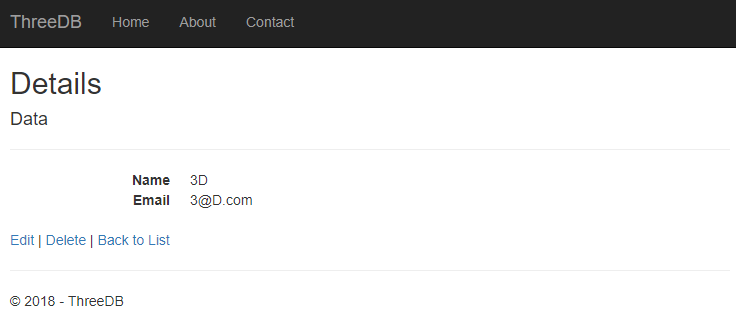

# ThreeDB

#### By [Jasun Feddema](https://github.com/jaybojaybojaybo)

## Description

ThreeDB is a 3D database visualization app, intended to give the user more visual information than is currently provided via a two dimensional representation.  With 3D, the user is afforded instant recognition of volume, data type, and relationships.  Step into this database and immersively interact with the data.

Soon to be hosted At [ThreeDB](https://threedb20180516082054.azurewebsites.net/)

## User stories
* As a user, I would like see my database represented three dimensionally.
* As a user, I would like to have full CRUD functionality with all 3D data objects.
* As a user, I would like to navigate this 3D environment with WASD or arrow controls.
* As a user, I would like 3D data objects to indicate that my cursor is hovering over them.

## Soon to Come:
* App Deployment
* Multiple Database - with 3D shapes indicating data type
* Foreign Keys represented as highlighted items between tables.
* Mapping to most popular 3D navigation controls
* Voice Recognition login

## Run through   


After following link to ThreeDB, the user is met with the main view of the database.   


If the user aims the cursor at the Create cube and clicks, the user is brought to the Create page - to create a new data cube with simple user information.   



If the user aims the cursor at any data cube and clicks, the user is brought to that data cube's Details page and is presented with options to edit or delete that data cube. 


Check out the demo of a user navigating the 3D database.

## Setup

* Within terminal, clone this [repository](https://github.com/jaybojaybojaybo/ThreeDB) into the directory of your choice.
* Once cloned, navigate into the project folder and open with Visual Studio Community 2017.
* Right click the solution folder and select build.
* Open an instance of MAMP with the following configuration:
  * port: 8889
  * uid: root
  * pwd: root
  * If you have a different local database server, you will need to change the connection string settings in appsettings.json and Models/ThreeDBContext.cs
* Press the IIS Express play button. 
* The app should automatically open in your default browser.


## Support and contact details

* contact the author at jasun.feddema@gmail.com

## Technologies Used

* C#
* .NET
* AFrame

### License

Copyright (c) 2018 Jasun Feddema
```
Permission is hereby granted, free of charge, to any person obtaining a copy of this software and associated documentation files (the "Software"), to deal in the Software without restriction, including without limitation the rights to use, copy, modify, merge, publish, distribute, sublicense, and/or sell copies of the Software, and to permit persons to whom the Software is furnished to do so, subject to the following conditions:

The above copyright notice and this permission notice shall be included in all copies or substantial portions of the Software.

THE SOFTWARE IS PROVIDED "AS IS", WITHOUT WARRANTY OF ANY KIND, EXPRESS OR IMPLIED, INCLUDING BUT NOT LIMITED TO THE WARRANTIES OF MERCHANTABILITY, FITNESS FOR A PARTICULAR PURPOSE AND NONINFRINGEMENT. IN NO EVENT SHALL THE AUTHORS OR COPYRIGHT HOLDERS BE LIABLE FOR ANY CLAIM, DAMAGES OR OTHER LIABILITY, WHETHER IN AN ACTION OF CONTRACT, TORT OR OTHERWISE, ARISING FROM, OUT OF OR IN CONNECTION WITH THE SOFTWARE OR THE USE OR OTHER DEALINGS IN THE SOFTWARE.
```